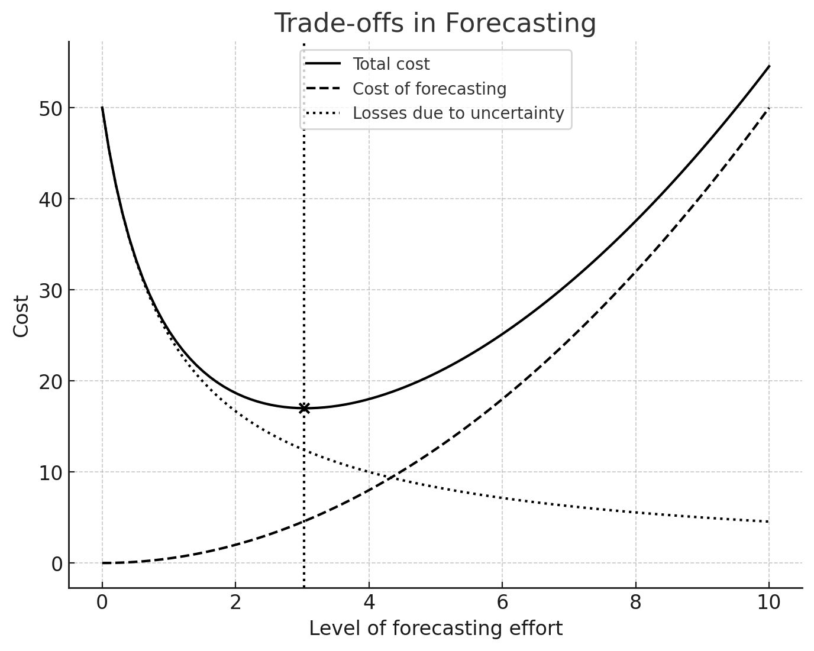

# The Marginal Cost of Information: When Is Enough Data Enough for Time Series Analytics

Information is never free. Whether it is collected through surveys, purchased from a third party, extracted from public records, or generated through experimentation, acquiring data always incurs costs. These costs can be direct, such as paying for proprietary data or running a costly field study, or indirect, such as the time spent cleaning, processing, and analyzing raw information. Every additional piece of data comes with diminishing returns---the first few data points might drastically improve decision-making, but after a certain threshold, the value of additional data flattens out, while costs continue to rise.

Economists describe this phenomenon as the marginal cost of information. Just as in production, where each additional unit of output requires more inputs, each additional piece of data requires effort to collect, store, and analyze. The challenge for decision-makers and analysts is knowing when to stop---when the cost of acquiring more information exceeds the expected benefit of improved decision-making.

# Optimal Stopping: When Is Enough Data Enough?

The theory of optimal stopping provides a structured way to approach this problem. In many decision-making scenarios, we must balance exploration (gathering more information) with exploitation (acting on what we already know).

The famous secretary problem is a classic example: Imagine you are hiring a secretary and must decide whether to hire a candidate immediately or keep searching, knowing that once you reject someone, you cannot return to them. Mathematically, the optimal strategy suggests reviewing about 37% of the candidates without hiring, then selecting the first one who is better than all previous ones.

This principle applies broadly in analytics. At what point do we have enough data to make a confident decision? In machine learning, more training data usually improves model accuracy---but only up to a point. Adding more observations beyond that threshold introduces higher costs in computation, storage, and complexity without significant improvements in predictive power. In business intelligence, delaying decisions to gather more data can mean missing time-sensitive opportunities.

Key considerations in optimal stopping for analytics include:

- Cost-benefit trade-offs: Does the added information materially improve decision-making?

- Timeliness: Is waiting for more data worth the delay in action?

- Sufficiency: Have we reached a stable level of accuracy or confidence?

- Diminishing returns: Are additional data points contributing meaningfully to insights?

# Analytics Is About Choice: What Do We Want to Know?

All analytics begins with a choice: What do we want to know? This choice dictates every subsequent decision about data collection, modeling, and interpretation. The goal determines the necessary data, not the other way around.

For example, if an energy company wants to predict well decline curves, it needs historical production data, geological features, and possibly economic conditions. If the goal is optimizing maintenance schedules, then sensor readings, downtime records, and operational logs become more relevant. The choice of the problem shapes the choice of data.

However, the reverse is also true. The data we have limits the questions we can ask. If a company only tracks monthly production without well-specific geological attributes, it cannot analyze how different rock formations impact decline rates. In many cases, analysts must navigate this reality by either adjusting their questions to fit available data or seeking additional data sources.

# The Analyst's Role: Analytics Is Not Passive

A common misconception is that analytics is a passive process---data is fed into an algorithm, and insights emerge. In reality, analytics is deeply active and subjective. The analyst plays a pivotal role in shaping the outcome through a series of choices:

- What questions to ask: The framing of the problem determines what data is relevant.

- What data to use: The analyst decides which datasets to include or exclude.

- How to transform the data: Cleaning, filtering, normalizing, and aggregating data all impact results.

- What features to engineer: Selecting the right variables enhances predictive power.

- What contextual data to incorporate: External factors like economic trends or weather conditions may provide critical insights.

- What models to use: Choosing between linear regression, neural networks, or decision trees affects interpretability and accuracy.

- How to interpret results: Statistical significance, business context, and potential biases all shape the conclusions drawn.

Each of these choices affects the outcome. A different set of decisions could lead to different conclusions from the same dataset.

# The Takeaway: Making Informed Trade-Offs

There is always a trade-off between acquiring more information and acting on what we already know. The marginal cost of information is a real constraint, and analytics is about making active, deliberate choices about data and methods. Optimal stopping principles help us determine when we have enough information to act, while recognizing that analytics is not just about answering questions---it is about choosing which questions to ask in the first place.

For analysts, the most important skill is not just working with data, but knowing when to stop collecting it and when to shift focus to making decisions.

# Illustrating the Trade-offs in Forecasting Effort

The graph above visualizes the trade-offs inherent in forecasting by illustrating three key cost components:

- Cost of Forecasting (Dashed Line): As forecasting effort increases, the cost of gathering, processing, and analyzing data rises. This follows a quadratic trend, reflecting the reality that deeper analysis often requires exponentially more resources.

- Losses Due to Uncertainty (Dotted Line): When forecasting effort is low, uncertainty remains high, leading to significant potential losses. As forecasting effort increases, these losses decline because better predictions reduce risk exposure.

- Total Cost (Solid Line): This represents the sum of both the forecasting cost and the losses due to uncertainty. Initially, as forecasting effort increases, total cost declines due to the sharp reduction in uncertainty-related losses. However, beyond a certain point, the increasing cost of forecasting outweighs the marginal reduction in uncertainty, causing total cost to rise again.

## The Optimal Forecasting Effort

The vertical dotted line marks the optimum level of forecasting effort, which occurs at the minimum point of the total cost curve. At this level:

- Additional forecasting effort would increase total costs due to diminishing returns.

- Less forecasting effort would leave too much uncertainty, leading to higher risk exposure.

# Why This Matters

This visualization reinforces a crucial concept in analytics and decision-making: more data and analysis are not always better. Instead, the goal should be to find the balance where additional effort provides just enough improvement in decision quality to justify its cost. The principle of optimal stopping applies here---knowing when to stop forecasting is just as important as knowing how to do it.

Decision-makers can use this to allocate resources efficiently and ensure that forecasting efforts remain both cost-effective and actionable.

## Key Takeaways

- Cost-benefit trade-offs: Does the added information materially improve decision-making?
- Timeliness: Is waiting for more data worth the delay in action?
- Sufficiency: Have we reached a stable level of accuracy or confidence?
- Diminishing returns: Are additional data points contributing meaningfully to insights?
